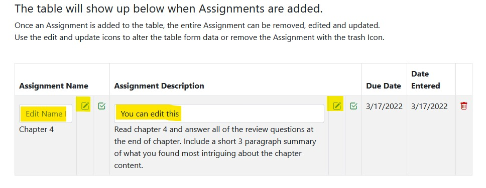

### Author: Robin Mckim

DEMO SITE: https://mckim-assignment-tracker.netlify.app/

This is a simple Assignment tracker application built with AngularJS. It uses an older version of AngularJS but I hope to rebuild it in a newer version of Angular when time is available to do so. It also includes an offscreen modal that allows a user to listen to relaxing meditational music from a SoundCloud audio player.

The application makes use of Bootstrap 5 and Bootstrap Icons font for ease of styling.

- bootstrap@5.0.2
- bootstrap-icons@1.5.0/font

Jquery Library:

- https://ajax.googleapis.com/ajax/libs/jquery/1.11.3/jquery.min.js

AngularJS Library:

- https://ajax.googleapis.com/ajax/libs/angularjs/1.8.2/angular.min.js

- Only one Angular controller is used for this application.

### Features

- User may enter and track assignments by name, due date and description.
- After submitting the form data, it is collected and showed within a table structure beneath the form and above the Take A Break Button.
- After an assignment has been created, a user may edit the assignment name or description using the edit icon next to each.
- After editing the form field data, the user can save the new information by clicking the update icon.
- The user may also choose to delete an assignment entry by using the trash icon to remove it.
- The user may click the Take A Break Button to be offered a relaxing SoundClound meditational music track to listen to while they enter assignment information. This appears as an offscreen modal from the bottom of the page.

### Application Screenshots

<table align="center"> 
  <tr>
    <td>
      
    </td>
    <td>
      
    </td>
  </tr>
</table>

The following screenshot shows the assignment fields that can be edited and updated using the icons related to the actions they perform.

The following screenshots show the modal button and the triggered offscreen area that appears from the bottom.

<table align="center"> 
  <tr>
    <td>
      
    </td>
    <td>
      
    </td>
  </tr>
</table>
